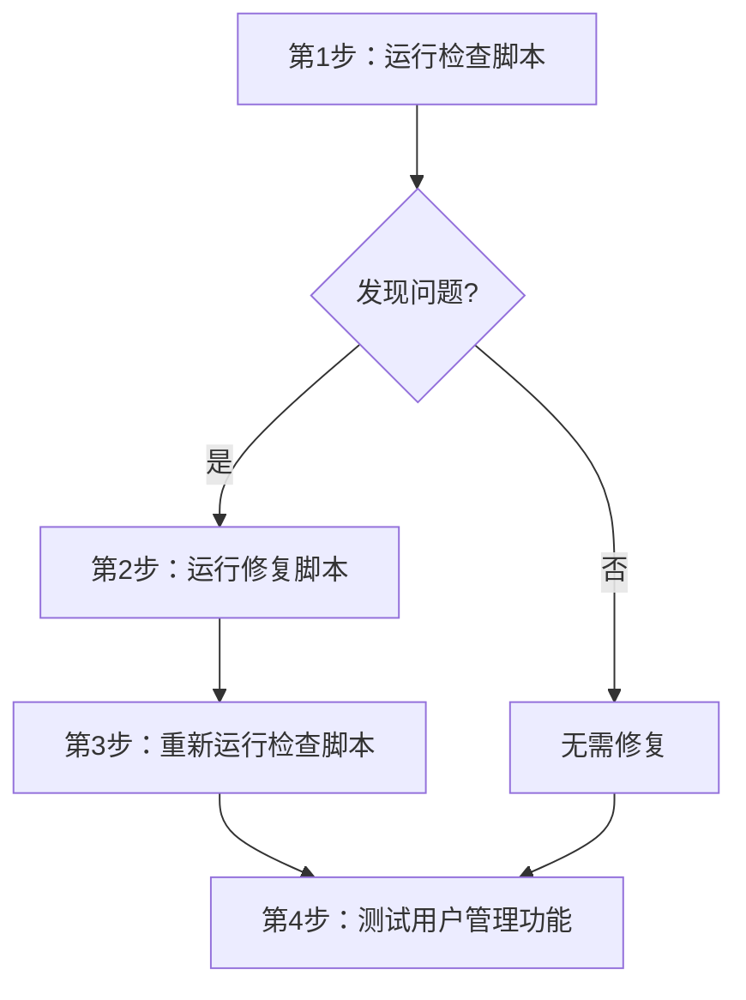

# RLS 策略修复指南

## 📋 问题背景

在用户管理中修改用户角色时，遇到了 RLS（Row Level Security）策略错误：

```
new row violates row-level security policy for table "permission_audit_logs"
```

## 🔍 根本原因

数据库的行级安全策略（RLS）配置不当，导致：
1. 管理员无法向 `permission_audit_logs` 表插入审计日志
2. 可能还有其他表存在类似问题
3. 部分策略使用了过时的 `user_roles` 表检查权限

## ✅ 已修复的问题

### 1. `permission_audit_logs` 表
- ✅ 脚本：`scripts/fix-permission-audit-logs-rls.sql`
- ✅ 状态：**已运行**
- ✅ 修复：允许认证用户插入审计日志

### 2. `is_finance_or_admin()` 函数
- ✅ 脚本：`scripts/fix-invoice-permission-for-new-admins.sql`
- ✅ 状态：**已运行**
- ✅ 修复：改为检查 `profiles.role` 而不是 `user_roles` 表

## 🛠️ 推荐的后续操作

### 步骤 1：全面检查 RLS 策略

运行检查脚本，查看所有表的 RLS 状态：

```bash
scripts/comprehensive-rls-policy-check.sql
```

**这个脚本会检查：**
- ✅ 所有权限检查函数（`is_admin`, `is_finance_or_admin` 等）
- ✅ 核心用户管理表的 RLS 状态
- ✅ 所有表的 RLS 策略详情
- ✅ 缺少策略的表
- ✅ 使用旧式权限检查的策略

**输出内容：**
1. 权限检查函数列表
2. 当前用户权限测试结果
3. 各表的 RLS 策略详情
4. 使用 `is_admin()` 等函数的策略列表
5. 总结报告

### 步骤 2：修复所有用户管理表的 RLS 策略

如果检查发现问题，运行修复脚本：

```bash
scripts/fix-all-user-management-rls-policies.sql
```

**这个脚本会修复：**
- ✅ `profiles` 表（用户信息）
- ✅ `user_permissions` 表（用户权限）
- ✅ `user_roles` 表（用户角色）
- ✅ `user_projects` 表（用户项目关联）

**修复策略：**
- **SELECT**：用户可以查看自己的数据，管理员可以查看所有
- **INSERT**：只有管理员可以创建
- **UPDATE**：用户可以更新自己的部分数据，管理员可以更新所有
- **DELETE**：只有管理员可以删除

## 📊 执行顺序



### 详细步骤：

#### 1. 运行检查脚本
```sql
-- 在 Supabase SQL 编辑器中运行
-- 文件：scripts/comprehensive-rls-policy-check.sql
```

#### 2. 如果发现问题，运行修复脚本
```sql
-- 在 Supabase SQL 编辑器中运行
-- 文件：scripts/fix-all-user-management-rls-policies.sql
```

#### 3. 重新运行检查脚本验证
```sql
-- 再次运行检查脚本，确认所有问题已修复
-- 文件：scripts/comprehensive-rls-policy-check.sql
```

#### 4. 测试用户管理功能
- ✅ 修改用户角色
- ✅ 修改用户权限
- ✅ 创建新用户
- ✅ 删除用户

## 🎯 预期结果

修复后，管理员应该可以：
- ✅ 正常修改用户角色（admin ↔ finance ↔ operator 等）
- ✅ 正常修改用户权限
- ✅ 正常创建和删除用户
- ✅ 查看所有用户的信息
- ✅ 查看所有审计日志

普通用户应该：
- ✅ 可以查看自己的信息
- ✅ 可以更新自己的部分信息（如姓名、电话）
- ❌ 无法修改自己的角色
- ❌ 无法查看其他用户的信息
- ❌ 无法修改其他用户

## 📝 相关文件

### 已运行的脚本
1. `scripts/fix-permission-audit-logs-rls.sql` - 修复审计日志表 RLS
2. `scripts/fix-invoice-permission-for-new-admins.sql` - 修复开票权限

### 新创建的脚本
3. `scripts/comprehensive-rls-policy-check.sql` - 全面检查 RLS 策略
4. `scripts/fix-all-user-management-rls-policies.sql` - 修复所有用户管理表 RLS

## 🔧 技术细节

### RLS 策略的三个关键部分

1. **USING 子句**：控制哪些行可以被查看/修改
2. **WITH CHECK 子句**：控制插入/更新后的行是否符合策略
3. **角色**：`authenticated`（已登录用户）、`anon`（匿名用户）

### 示例策略结构

```sql
CREATE POLICY "policy_name"
ON table_name
FOR SELECT          -- 操作类型：SELECT, INSERT, UPDATE, DELETE, ALL
TO authenticated    -- 应用对象：authenticated, anon, public
USING (             -- 查询过滤条件
    user_id = auth.uid()
    OR EXISTS (
        SELECT 1 FROM profiles 
        WHERE id = auth.uid() AND role = 'admin'
    )
)
WITH CHECK (        -- 插入/更新检查条件（可选）
    user_id = auth.uid()
);
```

### 权限检查最佳实践

❌ **不推荐**：使用函数调用（可能有缓存问题）
```sql
USING (is_admin())
```

✅ **推荐**：直接使用 EXISTS 查询
```sql
USING (
    EXISTS (
        SELECT 1 FROM profiles 
        WHERE id = auth.uid() AND role = 'admin'
    )
)
```

## 🚨 注意事项

1. **备份数据**：在运行修复脚本前，建议备份数据库
2. **测试环境**：如果可能，先在测试环境运行
3. **权限影响**：修复会影响所有用户的权限，请在低峰期执行
4. **事务管理**：修复脚本使用了 `BEGIN`/`COMMIT`，如果出错会自动回滚

## 📞 如果还有问题

如果修复后仍有问题，检查：

1. **用户角色**：确认当前用户确实是 `admin` 角色
   ```sql
   SELECT role FROM profiles WHERE id = auth.uid();
   ```

2. **函数定义**：确认 `is_admin()` 函数正确
   ```sql
   SELECT is_admin();
   ```

3. **策略冲突**：检查是否有冲突的策略
   ```sql
   SELECT * FROM pg_policies 
   WHERE tablename = 'your_table_name';
   ```

---

**创建时间**：2025-11-03  
**状态**：✅ 待执行检查和修复脚本  
**优先级**：高

